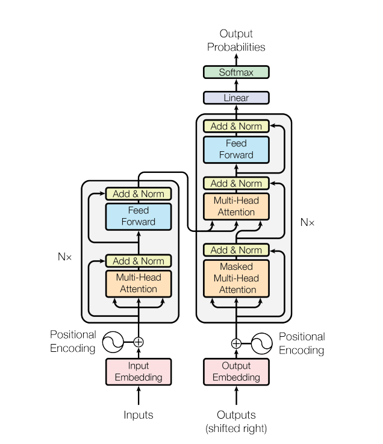

# Transformer Architecture {#architecture}

```{r architecture, echo=FALSE, fig.cap="Transformer", fig.align='center'}
#knitr::include_graphics(file.path(here::here(), "book", "transformer.png"))
#path <- file.path(working_dir, "images", "transformer.png")
#print(file.exists(path))
#path2 <- '/home/user/projects/transformer-high-level-keras-api/book/images/transformer.png'

```

The transformer has an encoder-decoder structure as is typical for neural sequence transduction models, e.g. language translation. The encoder encodes a sequence of tokens $(x_1,\dots,x_n)$ from the first language to a continuous representation $\mathbf z=(z_1,\dots,z_n)$ in $\dmodel$-dimensional Euclidean space, i.e. each $z_i\in\reals^{\dmodel}$. The decoder the maps this representation to a sequence of tokens $(y_1,\dots,y_m)$ auto-regressively: each symbol $y_j$ is predicted from $\mathbf z$ and the previously predicted symbols $y_1\dots,y_{j-1}$.

In all of the code snippets below, the imports are not shown but are included in the following:

```{python imports}
import tensorflow as tf
from tensorflow.keras import Sequential, Model
from tensorflow.keras.layers import Layer, Embedding, Dropout, LayerNormalization, Input
```

Filenames in this section are relative to the `transformer` subdirectory of the source code.

## Embeddings

The initial layer of the both the encoder and decoder map input and output symbols to $\dmodel$-dimensional space, respectively. This is the usual learned embedding, where for each symbol $\dmodel$ weights are learned which map this symbol to $\dmodel$-space. These embeddings tend to have desirable properties which make them interesting in their own right. For example, when the symbols are tokens obtained from some language those with similar meanings have closer embeddings in $\dmodel$-space.

## Masking

The Keras API has built in support for masking, which is used to ignore specified positions in sequential inputs. It is described for example in the [TensorFlow Keras Guide on Masking and Padding](https://www.tensorflow.org/tutorials/text/transformer "Masking and padding with Keras"). Layers that utilize masking are either mask consumers or producers, where the latter can also modify an existing mask. In the transformer architecture the attention layers are the mask consumers.

There are two uses for masking in the architecture. The first is the usual one for sequence models. The input sequences are padded at the end with zeros so that each batch has members of the same length. These are masked out so that, for example, the position pair $(i, j)$ has zero attention weight whenever either the $i\Th$ or the $j\Th$ position of the input is padding. We define the `PaddingMask` layer to produce these masks.

```{python padding-mask}
_keras_mask_attr = '_keras_mask'

class PaddingMask(Layer):
    def __init__(self, mask_value=0):
        super().__init__()
        self.mask_value = mask_value

    def call(self, inputs):
        # Needed to ensure that mask gets recomputed
        if hasattr(inputs, _keras_mask_attr):
            delattr(inputs, _keras_mask_attr)
        return inputs

    def compute_mask(self, inputs, mask=None):
        return tf.math.not_equal(inputs, self.mask_value)
```

To implement a mask producing layer, the class member function `compute_mask` is implemented. It takes the inputs and an optional mask argument and uses them to produce a new mask. Keras stores a tensor's mask in the `_keras_mask` attribute. Notice that we remove this attribute in the `call` method. We found this to be necessary, because as we discovered TensorFlow has an efficiency "hack", where it does not produce a mask when a mask consuming layer's input already has a mask. However, the `PaddingMask` simply passes its input forward which might have some preexisting mask which needs to be replaced.

The other use of masking is in auto-regression. During training the decoder layer uses what is called *teacher forcing* where the loss is determined by the model's output at position $i$, where it receives the decoder input sequence up to but not including position $i$. This achieved by masking in the decoder self-attention layer (see below), where positions pairs $(i, j)$ with $i<j$ are masked out. This means that the $i\Th$ query can only do lookups with the first $i$ keys (see Attention and Decoder Layer below). Without this masking there is a mismatch between the training, and what happens during inference which is necessarily auto-regressive. Indeed, we confirmed that the model outputs nonsense when trained without the auto-regressive mask.

```{python autoregressive-mask}
def create_look_ahead_mask(size):
    """
    Lower-triangular Boolean matrix
    """

    mask = tf.cast(tf.linalg.band_part(tf.ones((size, size)), -1, 0), tf.bool)
    return mask  # (size, size)


class AutoRegressiveMask(Layer):
    def __init__(self):
        super().__init__()

    def call(self, inputs, mask=None):
        # Needed to ensure that mask gets recomputed
        if hasattr(inputs, _keras_mask_attr):
            delattr(inputs, _keras_mask_attr)
        return inputs

    def compute_mask(self, inputs, mask=None):
        if mask is None:
            return None

        seq_length = tf.shape(inputs)[1]

        look_ahead_mask = create_look_ahead_mask(seq_length)
        mask = tf.logical_and(look_ahead_mask, tf.expand_dims(mask, axis=1))
        return mask
```

## Positional Encodings

An effective sequence-to-sequence models takes into account the ordering of its input sequences. For example, in the case of language translation, it should be more than just a bag of words model. Positional encodings are used to inform the model of the position of each symbol in a given input sequence. Thus the integers, representing $0$-based indices, are mapped into $\reals^{\dmodel}$. The particular encoding used here is given by the Fourier basis functions with wavelengths varying with the dimensions: An integer $p$ is mapped to $E(p)=(E(p)_0,\dots,E(p)_{\dmodel-1})$ where \begin{equation}
\begin{split}
E_{2i}(p)&=\sin(p\cdot b^{-\frac{2i}{\dmodel}}),\\
E_{2i+1}(p)&=\cos(p\cdot b^{-\frac{2i}{\dmodel}}),
\end{split}
\end{equation} where $b$ is the base of the encoding. The wavelengths $\theta_i=2\pi\cdot b^{\frac{2i}{\dmodel}}$ form a geometric progression from $2\pi$ to $2b\pi$ (noninclusive). The $2i\Th$ dimension contains the $\sin$ Fourier basis functions at wavelength $\theta_i$, evaluated at $x=1$, and the $2i+1\Th$ dimension contains the $\cos$ basis functions at this wavelength. The use of varying wavelengths ensures that distant integers are dissimilar in $\dmodel$-space even though they might be very close in some dimensions. From basic properties of the Fourier basis, it follows that for each $k$ there exists a vector $\lambda_k\in\reals^{\dmodel}$ such that \begin{equation}
E(p+k)=\lambda_k\cdot E(p)\espc\text{for all $p$.}
\end{equation} In @attention it is hypothesized that this latter property allows the model to attend by relative position as well as actual position.

The code for the `ScaledEmbedding` layer is displayed here, slightly simplified from the class in `r py_anchor('embedding.py', base_dir = 'transformer')`. The `positional_encoding` function is from `r py_anchor('positional_encoding.py', base_dir = 'transformer')` and was taken verbatim from the [TensorFlow transformer tutorial](https://www.tensorflow.org/tutorials/text/transformer "Transformer model for language understanding").

```{python embedding}
class ScaledEmbedding(Layer):
    def __init__(self, input_dim, output_dim, dropout_rate, max_seqlen,
                 positional=True):
        super().__init__()
        self.embedding = Embedding(input_dim, output_dim, mask_zero=True)
        self.positional = positional
        if positional:
            self._positions_enc = positional_encoding(max_seqlen, output_dim)
        self.dropout = Dropout(dropout_rate)
        self._c = tf.math.sqrt(tf.cast(output_dim, dtype=tf.float32))
        self.supports_masking = True

    def call(self, inputs, training=None):
        x_enc = self.embedding(inputs) * self._c
        if self.positional:
            seq_len = tf.shape(inputs)[1]
            x_enc += self._positions_enc[:, :seq_len, :]
        return self.dropout(x_enc, training)
```

Custom layers that are not mask-producing, i.e. which do not modify the current input mask or create a new one, will destroy the current mask by default. Setting the `supports_masking` attribute to `True` allows the current mask to instead propagate through to the next layer unchanged. This is needed since we use `PaddingMask` before `ScaledEmbedding`, and this padding mask needs to be propagated to the encoder/decoder layers.

The dropout layer only has an effect during training, and for this reason our `call` method takes the optional Boolean `training` parameter to inform the `Dropout` layer. When using the Keras API for training or inference, it automatically passes the correct `training` value to all of its layers (including `ScaledEmbedding`). In fact, we do not even have to use the `training` parameter because the API will automatically pass the correct value to the dropout layer. However, we include it so that our custom `ScaledEmbededing` can also be used properly independently of the Keras API.

## Transformer Sublayers

The transformer architecture contains only attention sublayers and simple feed-forward sublayers: "Attention is all you need". Every sublayer in the transformer has a residual connection followed by Layer Normalization, which standardizes the output so that each sample has mean 0 and variance 1, as opposed to Batch Normalization which standardizes across the whole batch.

Residual connections avoid the problem of vanishing gradients, but more importantly avoid the *Degradation problem* where adding additional layers degrade accuracy even on the training set (so not due to overtraining). They are introduced in @he_deep_2016.

In general, mean/variance normalization speeds up stochastic gradient descent by creating a more symmetric error surface and also alleviates vanishing/exploding gradients in multilayer networks. *Batch Normalization* (BN) is a milestone technique, where the normalization is taken for each neuron over the input batch. BN is problematic for sequential models such as transformers, where the batch samples have differing sequence lengths. In @layer-normalization, the alternative *Layer Normalization* is introduced where the normalization is over each layer instead of neuron, but is taken one sample at a time avoiding the issue with differing sequence lengths. See also *Group Normalization*, @wu_group_2020 for more on generalizing Batch Normalization.

Given an input $x$, and possibly additional inputs $...$, the output is then\linebreak $\operatorname{LayerNorm}(x + \operatorname{SubLayer}(x, ...))$ where $\operatorname{SubLayer}(x, ...)$ is the output of either an attention or feed-forward sublayer. In order to facilitate the residual connections, the output of each layer, including the embedding layers, must have the same dimension $\dmodel$. The original paper used $\dmodel=512$ dimensions, while we used $\dmodel=128$.

The transformer sublayer is implemented in `r py_anchor('sublayer.py', base_dir = 'transformer')`.

```{python transformer-sublayer}
class TransformerSubLayer(Layer):
    def __init__(self, input_sublayer, input_key=None, epsilon=1e-6,
                 dropout_rate=0.1):
        super().__init__()

        self.input_sublayer = input_sublayer
        self.input_key = input_key
        self.epsilon = epsilon
        self.dropout_rate = dropout_rate
        self.dropout = Dropout(dropout_rate)
        self.layernorm = LayerNormalization(epsilon=epsilon)

    def call(self, inputs, training=False, mask=None):
        if self.input_key is not None:
            x = inputs[self.input_key]
        else:
            x = inputs
        sublayer_outputs = self.input_sublayer(inputs=inputs, mask=mask)
        outputs = self.dropout(sublayer_outputs, training)
        outputs += x  # Loses the mask info
        return self.layernorm(outputs)

    def compute_mask(self, inputs, mask=None):
        if mask is None:
            return None

        if self.input_key:
            return mask[self.input_key]
        return mask
```

The `input_sublayer` parameter is a TensorFlow `Layer` (in its use for the transformer this is either an attention sublayer or a feed-forward sublayer). The `inputs` to the `call` function are passed to this `input_layer`, and can be either a TensorFlow tensor or a `dict` mapping names to tensors in the case of multiple inputs. In the latter case, `input_key` indicates which member of the `dict` is the primary input to be used in the residual connection; and also the input masks are modified so that only the mask relevant to the output is returned.

## Attention

### Scaled Dot-Product Attention

Given $n_k$ keys of dimension $d_k$ and $n_v=n_k$ values of dimension $d_v$, packed into an $n_k\times d_k$ matrix $K$ and an $n_k\times d_v$ matrix $V$, respectively, along with $n_q$ queries of dimension $d_q=d_k$ packed as $Q$, the attention function outputs the following $n_q\times d_v$ matrix:  
\begin{equation}
  \textrm{Attention}(Q,K,V)=\textrm{softmax}\left(\frac{QK^\top}{\sqrt{d_k}}\right)V,
    (\#eq:attention)
\end{equation} 
where the $\mathrm{softmax}$ is rowwise, so that the rows are probability distributions, forming an $n_q\times n_k$ matrix of *attention weights*. Thus the $i^\mathrm{th}$ row of the attention weight matrix gives a probability distribution (i.e. weights) over the values used to resolve the $i^\mathrm{th}$ query, where each weight is determined by the compatibility of the query with the corresponding key.

In the case of sequence-to-sequence models, the $i^\mathrm{th}$ query corresponds to the $i^\mathrm{th}$ position of the input sequence and the $j^\mathrm{th}$ key/value pair corresponds to the $j^\mathrm{th}$ position of the target sequence, so that the attention mechanism determines how much weight is given to this pair in the output.

In `r py_anchor('attention.py', base_dir = 'transformer')`, we use nearly same code as in [TensorFlow transformer tutorial](https://www.tensorflow.org/tutorials/text/transformer "Transformer model for language understanding") to implement the scaled dot-product attention in \@ref(eq:attention), generalized to tensors and including masking, except that the `mask` parameter is a Boolean tensor (one Boolean value per timestep in the input) used to skip certain input timesteps when processing timeseries data.

```{python, scaled-dot-product-attention}
def scaled_dot_product_attention(q, k, v, mask):
    """Calculate the attention weights.
    q, k, v must have matching leading dimensions.
    k, v must have matching penultimate dimension, i.e.: n_k = n_v.
    q, k must have matching last dimension, i.e.: d_q = d_k.
    The mask has different shapes depending on its type(padding or look ahead)
    but it must be broadcastable for addition.

    Args:
      q: query shape == (..., n_q, d_q)
      k: key shape == (..., n_k, d_k)
      v: value shape == (..., n_v, d_v)
      mask: Boolean tensor with shape broadcastable
            to (..., n_q, n_k). Defaults to None.

    Returns:
      output, attention_weights
    """

    matmul_qk = tf.matmul(q, k, transpose_b=True)  # (..., n_q, n_k)

    # scale matmul_qk
    dk = tf.cast(tf.shape(k)[-1], tf.float32)
    scaled_attention_logits = matmul_qk / tf.math.sqrt(dk)

    # add -infinity to the masked out positions in the scaled tensor.
    if mask is not None:
        masked_out = tf.cast(tf.math.logical_not(mask), tf.float32)
        scaled_attention_logits += masked_out * -1e9

    # softmax is normalized on the last axis (n_k) so that the scores
    # add up to 1.
    attention_weights = tf.nn.softmax(scaled_attention_logits, axis=-1)  # (..., n_q, n_k)

    output = tf.matmul(attention_weights, v)  # (..., n_q, d_v)

    return output, attention_weights
```

### Attention Layer

For simplicity we present a single-head attention layer here. The actual transformer uses a multi-head attention layer in `r py_anchor('attention.py', base_dir = 'transformer')`. It is implemented as a [custom layer](https://www.tensorflow.org/tutorials/customization/custom_layers "Custom Layer"), using the Keras [Layer subclassing API](https://www.tensorflow.org/guide/keras/custom_layers_and_models "Making new Layers and Models via subclassing").

In the Keras Layer subclassing API, a custom layer is implemented as a `class` that inherits from `Layer`, and implements a `call` method with mandatory argument `inputs`, and "privileged" optional arguments `training` and `mask`. The API also specifies a `build` method for initialization steps which can only be performed after the input shape is known, but this does not apply to any of our layers.

The `SingleHeadAttention` layer is a [mask consuming layer](https://www.tensorflow.org/guide/keras/masking_and_padding#writing_layers_that_need_mask_information "Writing layers that need mask information"). Thus its `call` method exposes the `mask` parameter which gets passed on to `scaled_dot_product_attention`, to indicate which position pairs $(i, j)$ in the inputs and targets to ignore.

**`r py_anchor('single_head_attention_layer.py')`**

```{python single-head-attention-layer, eval=FALSE}
class SingleHeadAttention(Layer):
    def __init__(self, d_model):
        super().__init__()
        self.d_model = d_model
        self.dense = Dense(d_model)

    def call(self, inputs, mask=None):
        q, k, v = inputs['q'], inputs['k'], inputs['v']

        scaled_attention, attention_weights = scaled_dot_product_attention(
            q, k, v, mask)

        output = self.dense(scaled_attention)  # (batch_size, seq_len_q, d_model)

        return output, attention_weights
```

This layer performs the calculation: 
\begin{equation}
  \operatorname{SingleHeadAttention}(Q, K, V)=\operatorname{Attention}(Q, K, V)W^O,
   (\#eq:single-attention)
\end{equation} 
where $W^O\in\mathbb R^{d_v\times d_\mathrm{model}}$ is the learned linear projection of the scaled dot-product to $d_\mathrm{model}$-space. Note that even though we shall always have $d_v=d_\mathrm{model}$ the projection is still important to orient the output, since it is used in calculations such as $x+\operatorname{SingleHeadAttention}(x,x,x)$ where the orientation of the output becomes relevant. Indeed we verified that while the transformer still learns without the final projection, the results are substantially worse. (We did not make actual benchmarks, but simply inspected the model outputs after training for the same number of epochs in each case.)

#### Multi-Head Attention

The multi-head attention splits the attention mechanism into $n$ separate "heads", each with their own representation of the queries, keys and values. They run in parallel, allowing the model to attend simultaneously to different position pairs in different representation spaces: \begin{equation}
  \operatorname{MultiHeadAttention}(Q, K, V)=\operatorname{Concat}(\mathrm{head}_1,\dots,\mathrm{head}_n)W^O
\end{equation} where $\operatorname{Concat}$ is row-wise concatenation and \begin{equation}
  \mathrm{head}_i=\operatorname{Attention}(Q W_i^Q, K W_i^K , V W_i^V),
\end{equation} and $W_i^Q\in\reals^{\dmodel\times d_k}$, $W_i^K\in\reals^{\dmodel\times d_k}$, $W_i^V\in\reals^{\dmodel\times d_v}$ and $W^O\in\reals^{h d_v\times{\dmodel}}$ are projections.

In transformer architecture, the representation spaces are all of dimensions $d_q=d_k=d_v=\dmodel\div h$. We use $h=8$ heads as in the original paper, and saw an visible improvement of the single-head architecture. As noted in the paper, a single-head attention cannot simultaneously attend differently in different representation subspaces. If one tries to add projections $W^Q$, $W^K$ and $W^V$ in equation \@ref(eq:single-attention), they will simply be factored out into $W^O$ and have no effect.

The code for the `MultiHeadAttention` class is in `r py_anchor('attention.py', base_dir = 'transformer')` and is nearly the same as the corresponding class in the [official transformer tutorial](https://www.tensorflow.org/tutorials/text/transformer "Transformer model for language understanding"), except that the `call` method signature has been modified to conform with the Keras API.

#### Contextual Embeddings

In contrast to the embedding layers, which embed a symbol to the same vector regardless of its position in the sequence (besides the added positional encoding which encodes only its ordinal position), the attention layers are contextual embeddings meaning that the representation of each symbol is based on the entire input sequence---except when an auto-regressive mask is used so that it only depends on the preceding symbols in the sequence, as in the self-attention of the decoder layer described below.

## Feed-Forward Networks

Each transformer sublayer has a fully connected feed-forward network consisting of two layers with a single ReLU activation in between. The first layer has dimension $\mathrm{dff}$ which is $2048$ in the paper, while we use the smaller value of $512$ in our example code. The second output layer has dimension $\dmodel$, the same as the input. Note that each position of the sequential input gets passed through the identical feed-forward network. This is the only place in the transformer architecture where there is nonlinearity. It is where the queries, keys and values are learned for the self-attention layers of the encoder and decoder, as described next.

These can be easily implemented using the Sequential API. A slightly simplified version of the code in `feed_forward` is as follows.

```{python feed-forward}
def pointwise_feed_forward_network(d_model, dff):
    return Sequential([
        Dense(dff, activation='relu'),  # (batch_size, seq_len, dff)
        Dense(d_model)  # (batch_size, seq_len, d_model)
    ])
```

## Encoder

The encoder is a stack of $N$ identical encoder layers, where $N=6$ in the paper while we use 4 layers in our example. The output of the encoder, which is the output of the last encoder layer, is a sequence of elements in $\dmodel$-dimensions space of the same length as the sequence input to the encoder. This output $x$ is learned in the encoder layers to serve as a key-value lookup of the form $(x, x)$ (from $\dmodel$-space into $\dmodel$-space). This lookup is the information that is passed from the encoder to the decoder, where the decoder queries the lookup from its own input.

### Encoder Layer

Each encoder layer consists of a self-attention sublayer followed by a feed-forward sublayer. This is naturally implemented with the Sequential API. The following is (a slightly simplified version of) the function from `r py_anchor('encoder.py', base_dir = 'transformer')` which creates the encoder layer.

```{python encoder-layer}
def encoder_layer(d_model, num_heads, dff, dropout_rate):
    mha = MultiHeadSelfAttention(d_model, num_heads, mask_rank=2)
    ffn = pointwise_feed_forward_network(d_model, dff)

    return tf.keras.Sequential([
        TransformerSubLayer(mha, epsilon=1e-6, dropout_rate=dropout_rate),
        TransformerSubLayer(ffn, epsilon=1e-6, dropout_rate=dropout_rate)
    ])
```

The encoder itself can be simply implemented using the Sequential API. The `encoder` function from `r py_anchor('encoder.py', base_dir = 'transformer')` implements the entire encoder stack including the input embeddings.

```{python encoder}
def encoder(num_layers, d_model, num_heads, dff, input_vocab_size,
            maximum_position_encoding, dropout_rate):
    layer_list = [
        PaddingMask(mask_value=0),
        ScaledEmbedding(input_vocab_size, d_model, dropout_rate,
                        maximum_position_encoding, positional=True)] + \
        [encoder_layer(d_model, num_heads, dff, dropout_rate)
         for i in range(num_layers)]

    return Sequential(layer_list)
```

## Decoder

The decoder is a stack of $N$ identical decoder layers. The output of the decoder is fed to the model "head" and determines the probability distribution over the target symbols for each element in the decoder input sequence.

### Decoder Layer

Each decoder layer begins with a self-attention layer using the auto-regressive mask to prevent position $i$ attending on (i.e. looking up) a position $j>i$. Note that since the target is shifted by one, position $i$ should still looks up itself. This is followed by the encoder-decoder attention sublayer which uses the output of the self-attention decoder sublayer as a query to the key-value lookup output by the encoder. The third sublayer is the feed-forward sublayer.

We cannot use the Sequential API for the decoder layer since it takes two inputs: the encoder output and the decoder input. It can naturally be implemented using the Functional API. This is (a slightly simplified version of) the decoder layer creation function from `r py_anchor('decoder.py', base_dir = 'transformer')`.

```{python decoder-layer}
def decoder_layer(d_model, num_heads, dff, dropout_rate):
    encoder_output = Input(shape=(None, d_model), name='encoder_output')
    decoder_input = Input(shape=(None, d_model), name='decoder_input')

    auto_regress = AutoRegressiveMask()
    mha_self = MultiHeadSelfAttention(d_model, num_heads, mask_rank=4)
    mha_auto_reg = Sequential([auto_regress, mha_self])
    mha_self_sublayer = TransformerSubLayer(mha_auto_reg, epsilon=1e-6,
                                            dropout_rate=dropout_rate)

    mha_2inp = MultiHeadTwoInputAttention(d_model, num_heads)
    mha_2inp_sublayer = TransformerSubLayer(mha_2inp, input_key='queries',
                                            epsilon=1e-6, dropout_rate=dropout_rate)

    ffn = pointwise_feed_forward_network(d_model, dff)
    ffn_sublayer = TransformerSubLayer(ffn, epsilon=1e-6, dropout_rate=dropout_rate)

    out1 = mha_self_sublayer(decoder_input)
    out2 = mha_2inp_sublayer(dict(queries=out1, lookups=encoder_output))
    outputs = ffn_sublayer(out2)

    return Model(inputs=[encoder_output, decoder_input], outputs=outputs)
```

The decoder itself including the inputs can then also be implemented with the Functional API. From `r py_anchor('decoder.py', base_dir = 'transformer')`:

```{python decoder}
def decoder(num_layers, d_model, num_heads, dff, target_vocab_size,
            maximum_position_encoding, dropout_rate=0.1):

    encoder_output = Input(shape=(None, d_model), name='encoder_output')
    decoder_input = Input(shape=(None, ), name='decoder_input')

    embedding = Sequential([PaddingMask(),
                            ScaledEmbedding(target_vocab_size,
                                            d_model, dropout_rate,
                                            maximum_position_encoding,
                                            positional=True)])
    decoder_layers = [
        decoder_layer(d_model, num_heads, dff, dropout_rate=dropout_rate)
        for _ in range(num_layers)]

    x = embedding(decoder_input)
    for i in range(num_layers):
        x = decoder_layers[i](dict(decoder_input=x, encoder_output=encoder_output))

    return Model(inputs=[encoder_output, decoder_input], outputs=x)
```

Note that unlike the decoder layers the shape for the `decoder_input` is `(None, )` for the decoder itself, since the inputs are tokenized sequences which have not yet been embedded in $\dmodel$-space.

## Transformer Model

The final transformer model has two inputs, the tokenized encoder and decoder sequences. First the encoder input is fed to the stack of encoder layers, and the resulting output is combined with the decoder input to feed to the stack of decoder layers. The decoder output is then passed to a final fully connected layer whose dimension is the size of the target vocabulary (i.e. number of symbols), so that the model output can predict target symbols. More precisely, as an auto-regressive model it is predicting the next-symbol probabilities.

In @attention [\S3.4] it is stated that the encoder and decoder embedding layers and the final fully connected layer all share the same weight matrix, and thus all have the same symbol embedding. This method is introduced in @weight-tying, where is it claimed for example that an English/French translation task shares up to 90% of the same subwords (using the byte pair encoding compression algorithm for tokenization, rather than WodPiece used here). For this method the union of the subwords is taken so that the the source/target vocabularies are the same. In our implementation, the source and target vocabularies are not merged and these three weight matrices are all learned separately.

The transformer can be implemented naturally using the Functional API. The code in `r py_anchor('transformer.py', base_dir = 'transformer')` is slightly simplified as follows.

```{python transformer-model}
def transformer(num_layers, d_model, num_heads, dff,
                input_vocab_size, target_vocab_size,
                pe_input_max, pe_target_max, dropout_rate):

    encoder_input = Input(shape=(None,), name='encoder_input')
    decoder_input = Input(shape=(None,), name='decoder_input')

    encoder_stack = encoder(num_layers, d_model, num_heads, dff,
                            input_vocab_size, pe_input_max, dropout_rate)
    decoder_stack = decoder(num_layers, d_model, num_heads, dff,
                            target_vocab_size, pe_target_max, dropout_rate)
    final_layer = Dense(target_vocab_size)

    encoder_output = encoder_stack(encoder_input)
    decoder_output = decoder_stack(
        dict(decoder_input=decoder_input, encoder_output=encoder_output))
    final_output = final_layer(decoder_output)

    return Model(inputs=[encoder_input, decoder_input], outputs=final_output)
```

It is crucial to note that the mask on the `decoder_output` is propagated through the `transformer` model. The is used by the loss function, which ensures that the padding at the end of the sequences is not included in the loss calculation (but see the caveat in the Loss section). Similarly the mask is used by the metrics, in our case the accuracy metric, ignoring the padding for the metric calculation.
